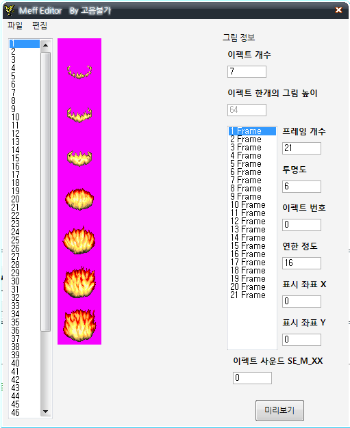

# Seongmin Yeon 연성민

<ysm1180@gmail.com>

[1]: http://www.globalsoft.co.kr
[4]: https://github.com/ysm1180/pl2015

## CV

+ <small>2016 ~ </small> [글로벌소프트][1]
  + OADD 솔루션 메인 개발자
  + 웹 개발자
  + 서버 관리자
  + Ahnlab 엔지니어

+ <small> 2013 ~ </small>서울대학교 공과대학 컴퓨터 공학 전공

+ <small>2010 - 2012</small> 남대전고등학교
    + 2011 한국정보올림피아드 경시대회 은상
    + 2011 대한민국 인재상

## Major Courses

+ 2014 - 1학기
  + 자료구조 (Java)
  + 컴퓨터 프로그래밍 (Java, C++)
  + 논리 설계 / 논리 설계 실험 (VHDL)
+ 2014 - 2학기
  + 프로그래밍 연습 (C)
  + 프로그래밍의 원리 (Racket, Ocaml)
  + 컴퓨터 구조 (C, Assembly)
+ 2015 - 1학기
  + 오토마타이론
  + [프로그래밍 언어][4] (Coq, Git) 
  + 시스템 프로그래밍 (Assembly, C)
+ 2015 - 2학기
  + 데이타베이스 (SQL)
  + 알고리즘
  + 운영체제 (C)
+ 2016 - 1학기
  + 소셜 네트워크 분석
  + 창의적 통합설계2 *<small>스마트워치용 대중교통 앱 개발</small>*

## Experience

+ Story of both *<small>2014. 02 - 2014. 06</small>*

  + SNS, Blog 등을 통해 영화, 만화 등의 스토리를 공모하는 웹 서비스 제작 참여

  + Front-end, Back-end 개발

  + 

[8]: https://github.com/ysm1180/NewJojoGame

+ [삼국지 조조전 Renewal][8] *<small>2017.09 ~</small>* `developing...`

  + Lua 스크립트를 연동하여 자유자재로 게임 시스템을 변경하는 형태로 새로 개발 중

  ​

## Featured Works

[2]: http://www.globalsoft.co.kr/oadd/oadd.php

> ### [OADD (Outlook Add-In )][2] *<small> PHP, LESS, Javascript (ES6), HTML5...</small>*

+ 대용량 / 조직도 Add-In for Outlook, Exchange Online

[3]: https://oaddin.globalsoft.co.kr/manage
> ### [OADD Web Manager][3] *<small> PHP, LESS, Javascript (ES6), HTML5...</small>*

+ OADD 웹 관리자

> ### 글로벌소프트 CRM for renew *<small>Node.js, Typescript (AngularJS), LESS</small>* 

> ### 대중교통 알리미 for Gear S2 *<small>HTML, CSS, Javascript...</small>*

+ 창의적 통합설계2 프로젝트 "*스마트워치용 대중교통 앱 개발"*

+ 기존의 Tizen 라이브러리의 문제점을 수정하고, 속도를 이용한 리스트 넘김 기능 추가
+ SOSCON 앱 공모전 3위

> ### 삼국지 조조전 MOD & Editor *<small>Assembly, VB, C#...</small>*

[5]: https://github.com/ysm1180/JojoLandEditor
[6]: http://cafe.naver.com/jojopeople/203473
[7]: http://cafe.naver.com/jojopeople/146995

+ 조조전 MOD / [네이버 카페][7]
  + Assembly Language로 자체 개조하여 기능 추가된 실행파일 EXE 포함
+ [지형 속성 편집기][5] / [네이버 카페][6]
  + 
+ ImsgEditor, MeffEditor, Etc...
  + 
  + 