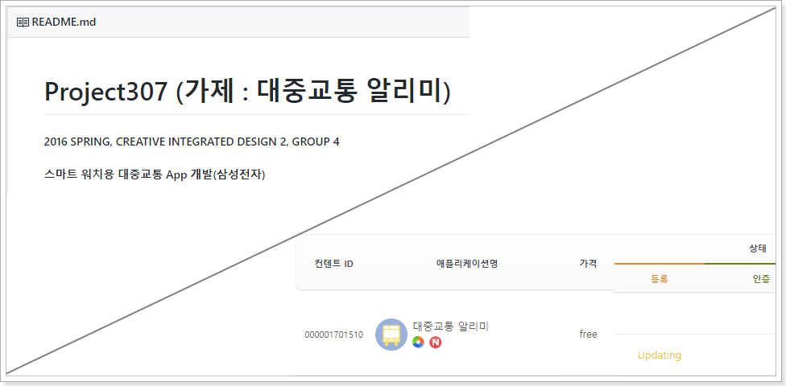
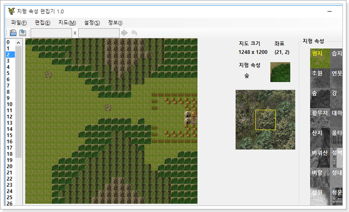

# Seongmin Yeon 연성민

<ysm1180@gmail.com>

[1]: http://www.globalsoft.co.kr
[4]: https://github.com/ysm1180/pl2015
[9]: http://www.shiftup.co.kr/

## Resume
+ <small>2018 ~ </small> [시프트업][9]
  + 게임 서버 개발자
    + AWS : EC2, RDS, Lambda, Redis, S3, ...
    + Language : PHP, Mysql
  + 게임 내부 데이터 조작 및 테스트 툴 개발
    + Language : C#
  + 게임 내부 개발 웹 툴 풀스택 개발 
    + AWS : EKS, Elatic beanstalk)
    + Language and framework : React(Webpack, Snowpack, Vite), Typescript, Next.js, Django, Node.js, FastAPI, 

+ <small>2016 ~ 2017 </small> [글로벌소프트][1]
  + OADD 솔루션 메인 개발자
  + 웹 개발자
  + 서버 관리자
  + Ahnlab 엔지니어

+ <small> 2013 ~ </small>서울대학교 공과대학 컴퓨터 공학 전공

+ <small>2010 - 2012</small> 남대전고등학교
    + 2011 한국정보올림피아드 경시대회 은상
    + 2011 대한민국 인재상

## Major Courses

+ 2014 - 1학기
  + 자료구조 (Java)
  + 컴퓨터 프로그래밍 (Java, C++)
  + 논리 설계 / 논리 설계 실험 (VHDL)
+ 2014 - 2학기
  + 프로그래밍 연습 (C)
  + 프로그래밍의 원리 (Racket, Ocaml)
  + 컴퓨터 구조 (C, Assembly)
+ 2015 - 1학기
  + 오토마타이론
  + [프로그래밍 언어][4] (Coq, Git) 
  + 시스템 프로그래밍 (Assembly, C)
+ 2015 - 2학기
  + 데이타베이스 (SQL)
  + 알고리즘
  + 운영체제 (C)
+ 2016 - 1학기
  + 소셜 네트워크 분석
  + 창의적 통합설계2 *<small>스마트워치용 대중교통 앱 개발</small>* for tizen

## Experience

+ [Node.js] Story of both *<small>2014. 02 - 2014. 06</small>*

  + SNS, Blog 등을 통해 영화, 만화 등의 스토리를 공모하는 웹 서비스 제작 참여

  + Front-end, Back-end 개발

  + 

+ [*PHP*, *Javascript*] Codeigniter 프레임 워크 기반의 대용량 첨부 / 조직도 Outlook Add-in 서비스 구축
  
  + [*PHP*, *Javascript*] Add-In 관리 페이지 구축
  + [*Python*, *Docker*] 웹 개발 테스트 서버 구축 자동화

[11]: https://github.com/ysm1180/coin
+ [*React*, *Node.js*] 가상 화폐 가격 정보 사이트 제작 ([Github][11]) 

    + Graph Chart 직접 개발

    

    

[12]: https://github.com/ysm1180/lol-study
+ [*Django*] 리그 오브 레전드 소환사 정보 확인 페이지 제작 ([Github][12])

     

+ [*Electron*, *Vue*, *Express*] [lol-explorer](https://github.com/ysm1180/lol-explorer) / [lol-explorer-server](https://github.com/ysm1180/lol-explorer-server) 미완성
  + 리그 오브 레전드 도우미
  + Riot games가 제공하는 API를 이용하여 통계를 수집하고 그 정보를 이용하여 지표 추천
  + 참조 : https://blitz.gg/lol

[13]: https://github.com/ysm1180/auto-chess-helper
+ [*Vue*] Dota 2 오토 체스의 시너지 확인 페이지 제작 ([Github][13])

    

[8]: https://github.com/ysm1180/ThreeKingdoms-Caocao

+ [삼국지 조조전 Renewal][8] *<small>2018 ~</small>* `developing...`

  + Lua 스크립트를 연동하여 자유자재로 게임 시스템을 변경하는 형태로 새로 개발 중

+ [*React, Typescript, Vite*] [Suit-UI](https://github.com/ysm1180/suit-ui)
  + React UI Library
  + Demo : https://ysm1180.github.io/Suit-UI/

## Featured Works

### SHIFTUP `대용량 아이템 지급 툴`, `아이템 쿠폰 생성 툴`, `서버 로그 뷰어`, `확률 시뮬레이터`, `이벤트 스케쥴러`, `서버 API 개발 Request 툴`
- 웹 기반으로 개발한 툴
- React, PHP, Webpack, Snowpack, Vite, Typescript, Django, Node.js 등 다양한 언어와 프레임워크를 이용한 개발 경험

[2]: http://www.globalsoft.co.kr/oadd/oadd.php

### Globalsoft [OADD (Outlook Add-In)][2] `대용량 첨부 / 조직도` - *<small>PHP, LESS, Javascript (ES6), HTML5, etc...</small>*   

[3]: https://oaddin.globalsoft.co.kr/manage
### GlobalSoft [OADD Web Manager][3] `OADD 웹 관리 페이지` - *<small>PHP, LESS, Javascript (ES6), HTML5...</small>* 
 

### Globalsoft CRM Renewal - *<small>Node.js, Typescript (AngularJS), LESS</small>* 

### 대중교통 알리미 for Samsung Galaxy Gear S2 `창의적 통합설계2 프로젝트` - *<small>HTML, CSS, Javascript, C++, etc...</small>* 

### 삼국지 조조전 MOD & Editor - *<small>Assembly, VB, C#, etc...</small>*

[5]: https://github.com/ysm1180/JojoLandEditor
[6]: http://cafe.naver.com/jojopeople/203473
[7]: http://cafe.naver.com/jojopeople/146995

#### 조조전 MOD - [네이버 카페][7]
##### Assembly Language로 자체 개조하여 기능 추가된 실행파일 EXE 포함

#### [지형 속성 편집기][5] - [네이버 카페 ][6]

#### ImsgEditor, MeffEditor, Etc...

[10]: https://github.com/ysm1180/newjojogame-script-editor

### 삼국지 조조전 Renewal
#### [Main Engine][8] - *<small>C++, Lua</small>*

#### [Script Editor][10] `게임 편집 툴` - *<small>Node.js, Typescript(Javascript), Electron, etc...</small>
    

