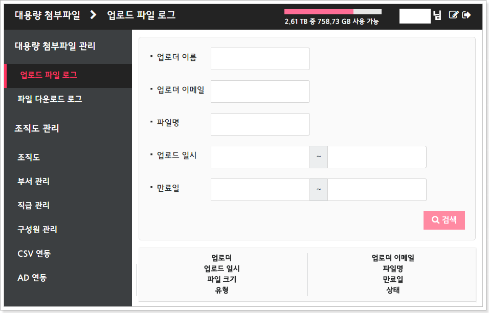

# Seongmin Yeon 연성민

<ysm1180@gmail.com>

[1]: http://www.globalsoft.co.kr
[4]: https://github.com/ysm1180/pl2015
[9]: http://www.shiftup.co.kr/
[11]: https://klleon.io

## 경력 사항

### 주식회사 어베어 (Windly.cc) | 2023.08 ~ 현재

해외 구매 대행 서비스를 제공하는 윈들리 서비스의 핵심 백엔드 개발자로, 기술 부채 개선부터 신규 기능 설계, 인프라 전환, AI 서비스 PoC까지 전방위적인 역량을 발휘했음

- 윈들리 해외구매대행 서비스 서버 포팅 및 유지보수 (Django → Kotlin/Spring Boot)

  - 기술 부채가 누적된 Django 기반 시스템을 Kotlin + Spring Boot로 전환하며 안정성과 확장성을 확보

  - 프로젝트 전환 기간(2023.12 ~ 2024.03) 내 주요 기능 80% 이관

  - 기술 부채의 70% 이상 해소하며 향후 기능 개발 속도 2배 이상 개선

- 국내 위탁 서비스 백엔드 아키텍처 설계 및 총괄 개발 (2025.01 ~ 2025.03)

  - 신 사업 서비스 런칭을 위한 서버 아키텍처를 제로에서 설계 및 구축

  - 업무 프로세스를 고려한 도메인 모델링과 API 설계를 통해 서비스 초기 안정화 주도

- "전세계 상품 수집" 기능 리딩 개발 (2024.07 ~ 2024.08)

  - 다양한 마켓플레이스 크롤링 및 카탈로그 통합 기능 구현

  - 전체 유입 사용자의 20%가 해당 기능 기반으로 전환되며 국내 위탁 서비스 PoC의 기반 역할 수행

- 백오피스 시스템 풀스택 개발 (Next.js + Nest.js)

  - 운영팀의 사용성을 고려한 프론트엔드 구성 및 API 설계/구현

  - CX팀의 업무 효율 향상을 위한 실무 친화적 기능 집중 개발 및 업무 자동화에 기여

- 클라우드 인프라 최적화 및 CI/CD 구축

  - 비용 절감을 위한 AWS에서 GCP로의 점진적 마이그레이션을 Terraform으로 자동화

  - 빌드, 테스트, 배포 파이프라인 구축으로 개발 주기 단축 및 배포 실수 방지

- 뉴렐릭 도입

  - 긴급 대응을 위한 모니터링 시스템 구축 및 대시보드 구성

- AI 이미지 생성 및 처리 기능 PoC 개발 (SDXL, Streamlit)

  - 서비스 내 AI 확장을 위한 프로토타입 구축 및 내부 테스트 사이트 개발

  - 생성형 AI 기술의 실무 적용 가능성 검토를 위한 주도적 프로토타입 구축

- Slack 기반 사내봇 개발 (Confluence, Jira, Git 등 검색 기능)

  - 조직 내 정보 접근성 향상 및 반복 업무 자동화를 위한 슬랙봇 직접 구현

  - 개발자 및 운영팀의 생산성 향상에 기여

### 클레온 | 2021.09 ~ 2022.05

AI 기반 얼굴 합성과 가상 휴먼 서비스에 특화된 스타트업에서 서버 개발 및 미디어 처리 시스템을 주도적으로 구축함

- AI 기반 얼굴 변환 SNS 앱 '카멜로' 백엔드 개발 (Django)

  - 이미지 업로드, 필터 처리, 사용자 관리 등 핵심 API 설계 및 구현

  - AWS 기반 인프라 구성 및 Docker 환경 내 배포 자동화

- 가상 휴먼 API 서비스 'Klone' 서버 개발 리드

  - 초기 Python + FastAPI 환경에서 Node.js + Nest.js + TypeScript 스택으로 점진적 전환

  - REST API를 기반으로 한 B2B SaaS형 서비스 구조 설계

- 미디어 AI 합성/처리 서버 시스템 구축 (Spring boot, Kotlin)

  - 영상 합성 및 트랜스코딩 파이프라인 설계 및 배포

  - ffmpeg 기반의 고성능 처리 로직 구현으로 렌더링 시간 단축 및 품질 개선

### 시프트업 | 2018.01 ~ 2021.09

데스티니 차일드 및 사내 개발 툴 전반의 서버 개발자로 활동하며, 게임 서버, 데이터 관리, QA 자동화 도구 등 다양한 도메인을 경험함

- 수집형 RPG 게임 서버 개발 (PHP)

  - 대용량 아이템 지급/회수 로직, 확률 기반 콘텐츠 API 개발

  - AWS 기반 운영환경 내 성능 최적화 및 장애 대응 경험

- 사내 QA 및 데이터 시뮬레이션 툴 개발 (C#)

  - QA용 수치 검증, 자동 테스트 도구 설계 및 배포

- 게임 운영용 웹 툴 풀스택 개발 (React, TypeScript, Next.js, Node.js)

  - 서버 로그 뷰어, 쿠폰 발급기, 확률 시뮬레이터 등 다양한 실시간 툴 개발

### 글로벌소프트 | 2016 ~ 2017

Outlook Add-on 대용량 첨부/조직도 솔루션의 핵심 개발자로서, Outlook Add-on 연동 및 웹 시스템 관리, 서버 운영까지 수행함

- OADD 메인 서버 및 웹 관리 페이지 개발 (PHP, JavaScript)

  - Codeigniter 프레임 워크 기반의 대용량 첨부 / 조직도 Outlook Add-in 서비스 구축

  
  
  

- On-premise 서버 및 배포 자동화 운영 담당

- 내부 CRM 시스템 리뉴얼 개발
  

- Ahnlab 외부 협력 엔지니어로 안랩 솔루션 기술 지원

## 학력

### 서울대학교 공과대학 컴퓨터 공학 전공 | 2013 ~ 2019

### 남대전고등학교 | 2010 ~ 2012

- 한국정보올림피아드 경시대회 동상 (2011)

- 대한민국 인재상 (2011)

## 주요 프로젝트 및 활동

[11]: https://github.com/ysm1180/coin

- 가상 화폐 가격 정보 사이트 개발 (React, Node.js) ([Github][11])

  - 실시간 가격 차트 직접 구현 및 거래소 연동 API 개발

  

  

[12]: https://github.com/ysm1180/lol-study

- 리그 오브 레전드 소환사 정보 웹 (Django) ([Github][12])

  

- [lol-explorer](https://github.com/ysm1180/lol-explorer) / [lol-explorer-server](https://github.com/ysm1180/lol-explorer-server) (Electron, Vue, Typescript, Node.js)
  - Riot API 활용한 데이터 분석 및 시각화

[13]: https://github.com/ysm1180/auto-chess-helper

- Dota 2 오토 체스의 시너지 확인 페이지 제작 (Vue) ([Github][13])

  

[8]: https://github.com/ysm1180/ThreeKingdoms-Caocao

- 삼국지 조조전 Renewal (C++, Lua) ([Github][8])

  - Lua 스크립트를 연동하여 자유자재로 게임 시스템을 변경하는 형태로 새로 개발 중

- [Suit-UI](https://github.com/ysm1180/suit-ui) (React, Typescript, Vite)

  - React UI Library
  - Demo : https://ysm1180.github.io/Suit-UI/

- 대중교통 알리미 for Samsung Galaxy Gear S2
  - 다운로드 수 1000회 이상
  - 삼성 내부 경진 대회에서 최우수상 수상
    
    

[5]: https://github.com/ysm1180/JojoLandEditor
[6]: http://cafe.naver.com/jojopeople/203473
[7]: http://cafe.naver.com/jojopeople/146995
[10]: https://github.com/ysm1180/newjojogame-script-editor

- 삼국지 조조전 MOD & Editor

  - 조조전 MOD [네이버 카페][7]

  - Assembly Language로 자체 개조하여 기능 추가된 실행파일 EXE 포함

  - 지형 속성 편집기 [네이버 카페][6]

  

  - ImsgEditor, MeffEditor, Etc...

  
