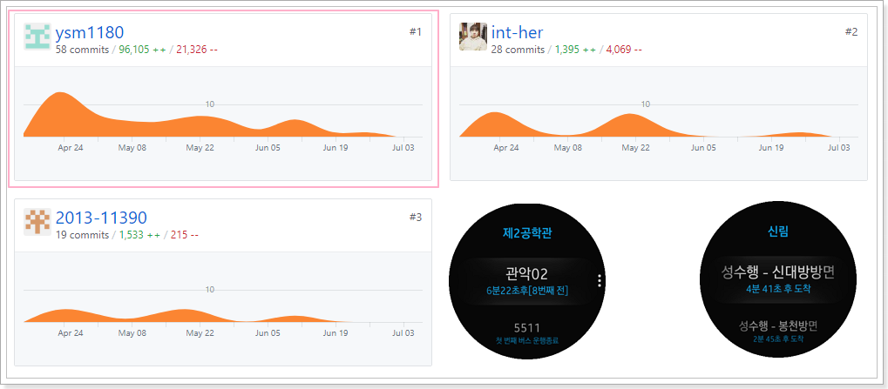

# Seongmin Yeon 연성민

<ysm1180@gmail.com>

[1]: http://www.globalsoft.co.kr
[4]: https://github.com/ysm1180/pl2015
[9]: http://www.shiftup.co.kr/
[11]: https://klleon.io

## 개인 프로젝트 및 활동

[11]: https://github.com/ysm1180/coin

- 가상 화폐 가격 정보 사이트 개발 (React, Node.js) ([Github][11])

  - 실시간 가격 차트 직접 구현 및 거래소 연동 API 개발

  

  

[12]: https://github.com/ysm1180/lol-study

- 리그 오브 레전드 소환사 정보 웹 (Django) ([Github][12])

  

- [lol-explorer](https://github.com/ysm1180/lol-explorer) / [lol-explorer-server](https://github.com/ysm1180/lol-explorer-server) (Electron, Vue, Typescript, Node.js)
  - Riot API 활용한 데이터 분석 및 시각화

[13]: https://github.com/ysm1180/auto-chess-helper

- Dota 2 오토 체스의 시너지 확인 페이지 제작 (Vue) ([Github][13])

  

[8]: https://github.com/ysm1180/ThreeKingdoms-Caocao

- 삼국지 조조전 Renewal (C++, Lua) ([Github][8])

  - Lua 스크립트를 연동하여 자유자재로 게임 시스템을 변경하는 형태로 새로 개발 중

- [Suit-UI](https://github.com/ysm1180/suit-ui) (React, Typescript, Vite)

  - React UI Library
  - Demo : https://ysm1180.github.io/Suit-UI/

- 대중교통 알리미 for Samsung Galaxy Gear S2
  - 다운로드 수 1000회 이상
  - 삼성 내부 경진 대회에서 최우수상 수상
    
    

[5]: https://github.com/ysm1180/JojoLandEditor
[6]: http://cafe.naver.com/jojopeople/203473
[7]: http://cafe.naver.com/jojopeople/146995
[10]: https://github.com/ysm1180/newjojogame-script-editor

- 삼국지 조조전 MOD & Editor

  - 조조전 MOD [네이버 카페][7]

  - Assembly Language로 자체 개조하여 기능 추가된 실행파일 EXE 포함

  - 지형 속성 편집기 [네이버 카페][6]

  

  - ImsgEditor, MeffEditor, Etc...

  
